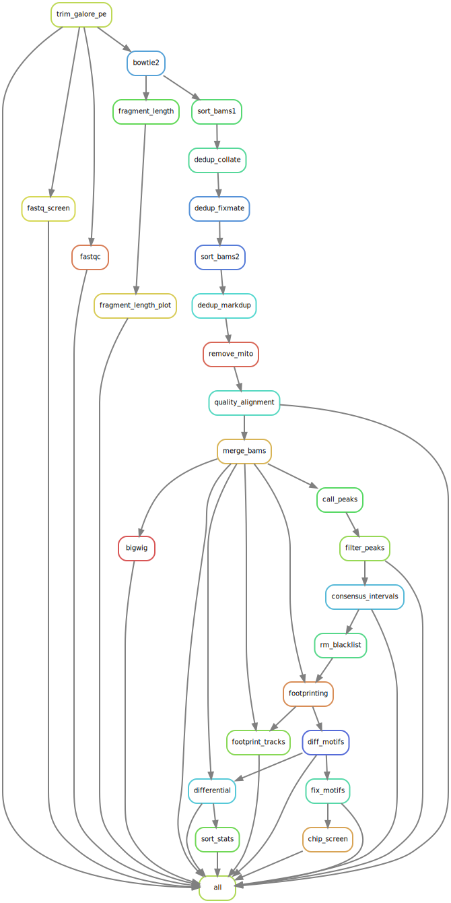

# HINT-ATAC

---

Find transcription factor footprints and test for differential chromatin openness in TF motifs using ATAC-Seq. This method is based on the original HINT-ATAC footprint method by [Zhijian Li _et al_](https://genomebiology.biomedcentral.com/articles/10.1186/s13059-019-1642-2). 

# Why find transcription factor footprints?

To answer the questions:

* Which TF binding sites have the most different chromatin openness states between two conditions?
* At open chromatin regions, what are possible TF's bound to that interval? 

# 1. Prepare your work environment

```bash
# clone this repo to a new working directory
git clone git@github.com:maxsonBraunLab/hint-atac.git

# cd into atac_seq2 and make new dir for your FASTQ files
mkdir -p samples/raw

# cd into 'samples/raw' and symlink your FASTQ files
ln -s /absolute/path/to/files/condition1_replicate1_R1.fastq.gz .
ln -s /absolute/path/to/files/condition1_replicate1_R2.fastq.gz .
```

# 2. Prepare your conda environment

Complete this step if you don't have a conda environment with snakemake installed

```bash
# while using base conda env, create your snakemake environment
conda install -c conda-forge mamba # installs into base env

# installs snakemake into new env
mamba create -c conda-forge -c bioconda -n snakemake snakemake 

# activate your new conda env
conda activate snakemake

# install plotly for QC plots
conda install -c plotly plotly
```

# 3. Configure config.yaml

This file helps define adapter sequences, bowtie2 genome index, conditions, replicates, and more. 

# 4. Prepare RGT environment

HINT-ATAC is part of the [Regulatory Genomics Toolbox](http://www.regulatory-genomics.org/hint/introduction/), and some of its modules need to be locally installed before running the pipeline. Here is the [configuration page](https://www.regulatory-genomics.org/rgt/rgt-data-folder/). Be extra thorough in this step because a lot of subtle things can be missed in this step, which will affect downstream work. Consult a bioinformatician if you are chronically running into trouble.

# 5. Special instruction: add a pseudo-signal in differential analysis

**This is only applicable if compute_factors function from RGT HINT does not have a pseudo-signal adjustment. Read on if you are confused. **

In the differential analysis process, reads are counted at custom genomic intervals across many conditions - this is akin to a signal. It is possible that in one condition, the summed signal value is zero. When a logarithm is applied to a zero signal, the code breaks; we have to manually add a pseudo-signal to prevent this from happening. More information about the problem can be found [here](https://github.com/CostaLab/reg-gen/issues/164), and the solution is detailed below.

1. Run the command `snakemake -j 1 --use-conda --conda-create-envs-only` to install the conda environments. 

2. cd into .snakemake/conda and search for the environment that houses the RGT packages with `grep "rgt" *.yaml` to get a hash. 

3. Given the hash (likely db877624), cd into that hash with: `cd db877624/lib/python3.7/site-packages/rgt/HINT`.

4. Open the the differential analysis file with `vi DifferentialAnalysis.py`, locate the compute_factors function, and change the code from this:

   ```python
   def compute_factors(signals):
       signals = np.sum(signals, axis=2)
       signals_log = np.log(signals)
       ...
   ```

   to this

   ```python
   def compute_factors(signals):
       signals = np.sum(signals, axis=2)
       signals_log = np.log(signals + 0.01)
       ...
   ```

5. Save and exit the file (please Google vi instructions). If your code already contains the crucial 'signals + 0.01' part, then go on to the next part. 

# 6. Run the pipeline

You can run the pipeline using an interactive node like this:

```bash
# request interactive node
srun --cores=20 --mem=64G --time=24:00:00 --pty bash

# activate snakemake environment
conda activate snakemake

# run snakemake in your workdir with 20 cores using pre-built conda envs
snakemake -j 20 --use-conda
```

This is sufficient for small jobs or running small parts of the pipeline, but not appropriate for the entire process. 

You can run the pipeline via batch mode like this:

```bash
snakemake -j 64 --use-conda --rerun-incomplete --latency-wait 60 --cluster-config cluster.yaml --cluster "sbatch -p {cluster.partition} -N {cluster.N}  -t {cluster.t} -J {cluster.J} -c {cluster.c} --mem={cluster.mem}" -s Snakefile
```

This will submit up to 64 jobs to exacloud servers and is appropriate for running computationally-intensive programs in parallel (read aligning, peak calling, footprinting, calculating differentially open chromatin  regions).

# Pipeline Summary

## Assumptions

* Symlinks or files are formatted like this: `{condition}_{replicate}_{R1|R2}.fastq.gz`
* Reads are paired-end from ATAC-Seq libraries
* Equal number of replicates per conditions (although can manually modify script to accommodate this)

## Inputs

- Reads in this specific format: `{condition}_{replicate}_{dir}.fastq.gz`

  - `Condition` = experimental treatment such as: 'MOLM24D',  'SETBP1_CSF3R_Mutant' , 'SETBP1_CSF3R_Control_8hr'. Multiple  underscores, text and number mixing is OK.
  - `Replicate` = biological replicate. acceptable values are integers >= 1.
  - `Dir` = read direction. Acceptable values are ['R1', 'R2'].
  - Reads must be symlinked in the `samples/raw` directory.

- Adapter file in FASTA format for adapter trimming in `config/trim_galore.fa`.

- Config file for fastq-screen in `config/fastq_screen.conf`.

- Correctly configured config file `config.yaml`.

## Outputs

- Quality Control

  - Fragment length distribution plot `samples/align/fragment_length/fragment_length_dist.png`

- MACs peaks per condition `data/macs/{condition}.broadPeak`

- Read pileup tracks `samples/align/bigwig/{cond}.bw`

- Footprint tracks `data/differential/tracks/{cond}.wig`

- List of TF's that show differential chromatin openness at binding sites between conditions `data/differential/diff_pseudocounts/{control}_{case}`

- List of bed files that address the question 'do my predicted TF footprints match up with public ChIP-Seq data?' `data/chip_screen/{cell_line}/{cond}_{cell_line}` 

  Outputs of TF footprints can best be visualized in IGV using the following tracks:

  1. Read pileups
  2. MACs peaks per condition
  3. TF footprints from HINT-ATAC
  4. Public ChIP-Seq tracks split by cell lines

## Methods



## Notes

* Pipeline takes about 6 hours to run for 9 samples.

# References

Li, Z., Schulz, M. H., Look, T., Begemann, M., Zenke, M., & Costa,  I. G. (2019). Identification of transcription factor binding sites using ATAC-seq. *Genome Biology*, *20*(1), 45. [[Full Text\]](https://genomebiology.biomedcentral.com/articles/10.1186/s13059-019-1642-2)